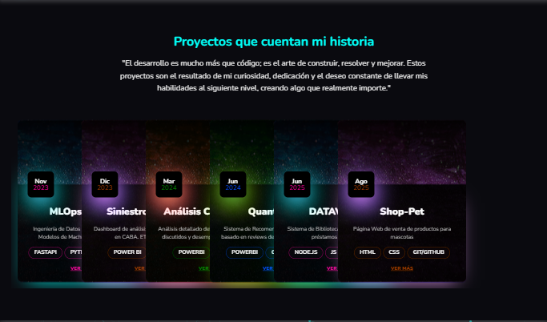
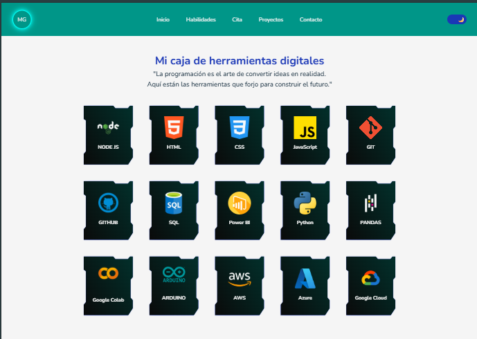

<p align="center">
  
</p>

<p align="center">
🌸 Proyecto Final <span style="font-size:1.2rem; font-weight:bold;">Front End</span>🌸 <br>
Maquetación Web con HTML y CSS
</p>

<p align="center" style="font-size:4rem; font-weight:bold;"> Landing Page de Portafolio Personal </p>

<p align="center">
  
</p>


## Descripción
Este proyecto es una landing page estática creada desde cero, cuyo principal objetivo fue consolidar y poner en práctica los conocimientos adquiridos en el curso de maquetación web. La página se desarrolló utilizando únicamente HTML5 para la estructura semántica y CSS3 para el diseño y los estilos.

El proceso se enfocó en una metodología **mobile-first**, asegurando que la experiencia de usuario fuera óptima en dispositivos móviles antes de adaptar el diseño a pantallas más grandes. Se utilizaron **Flexbox** y **Grid** para crear un layout flexible y adaptable, lo que permitió organizar el contenido de manera eficiente.

Además de la maquetación, se prestó especial atención a la personalización del sitio, implementando una paleta de colores y tipografías personalizadas, y añadiendo animaciones y transiciones sutiles para mejorar la interactividad y el atractivo visual.  

En resumen, este proyecto representa la culminación del aprendizaje, demostrando la capacidad de construir una página web moderna, responsive y visualmente agradable sin recurrir a frameworks o librerías externas.

--- 

## Características principales
- 🌐 **Diseño responsive** (mobile-first).  
- 📐 **Uso de Flexbox y Grid** para la organización del layout.  
- 🎨 **Paleta de colores personalizada** y tipografías de Google Fonts.  
- ✨ **Animaciones y transiciones** para mejorar la experiencia de usuario.  
- 🖼️ **Imágenes optimizadas** para la web.  
- 🔖 **Estructura CSS con BEM** para mantener el código organizado y modular.  
- 📈 **Optimización SEO** con etiquetas semánticas y metadatos.  
- 🌙 **Modo oscuro y claro** para mejorar la experiencia visual según la preferencia del usuario.

--- 

## Tecnologías utilizadas

<p align="center">
  
  
  
  
  

</p>

---

## Estructura del proyecto
```bash
📂 MaquetacionWeb-HTML-CSS-Portafolio
├── 📄 index.html
├── 📂 styles
│   ├── 0_configuracion_inicial.css
│   ├── 1_header.css
│   ├── 2_hero.css
│   ├── 3_skills.css
│   ├── 4_quote.css
│   ├── 5_project.css
│   ├── 6_contact.css
│   ├── 7_footer.css
│   └── styles.css
├── 📂 img
│   ├── MG.png
│   ├── presentacion.png
│   └── presentacion.webp
└── README.md
```

---

## Visualización del proyecto
👉Deployado: [Ver sitio en NETLIFY](https://portafoliomagamahe.netlify.app/)

👉 Deployado: [Ver sitio en GitHub Pages](https://magamahe.github.io/MaquetacionWeb-HTML-CSS-Portafolio/index.html)  

- https://portafoliomagamahe.netlify.app/

Si te interesa ver el código y visualizarlo en el navegador:  
1. Descargar el repositorio.
2. Abrir carpeta en Visual Studio Code  
2. Abrir el archivo index.html en cualquier navegador.  

---

## Capturas de pantalla
Ejemplo:  



_Visualización **Modo Oscuro** por defecto_




_Visualización **Modo Claro** por elección_

---

## Contacto

<p align="center">MARTINEZ HERRERO, María Gabriela</p>


<p align="center">
  <a href="https://github.com/magamahe" target="_blank">
    
  </a>
  &nbsp;&nbsp;
  <a href="https://linkedin.com/in/magamahe" target="_blank">
    
  </a>
  &nbsp;&nbsp;
  <a href="https://discord.com/users/@MaGabriela" target="_blank">
    <a href="https://discord.com/users/tu-discord-id" target="_blank">
  
</a>
<a href="mailto:magamahe@gmail.com">
  
</a>

